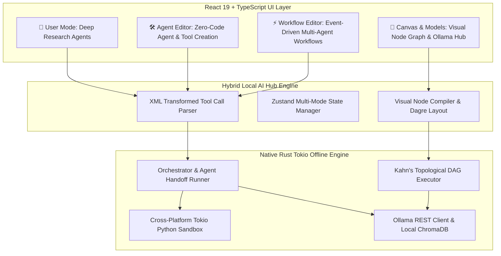

# Hybrid Local AI Hub — 100% Offline Zero-Code Multi-Agent & Workflow Framework

[](https://tauri.app/)
[](https://react.dev/)
[](https://www.rust-lang.org/)
[](https://ollama.com/)
[](https://www.trychroma.com/)
[](LICENSE)

A **100% offline**, privacy-first, free & open-source, cross-platform desktop framework and visual AI workflow hub built with **Tauri v2 + React 19 + TypeScript + Rust**. **Hybrid Local AI Hub** empowers non-technical users and developers to create, customize, and orchestrate complex LLM agents, tools, and workflows through **Natural Language Alone** — running entirely on local hardware with zero cloud dependencies or subscription costs.

---

## 🌟 Architecture Overview



---

## 🚀 Core Operating Modes

### 1. 💬 `User Mode` (Deep Research Agents)
- Autonomous Generalist Multi-Agent System:
  - **Orchestrator Agent**: Decomposes user goals, plans execution steps, and coordinates specialized sub-agents.
  - **Local File Agent**: Reads documents (`.pdf`, `.txt`, `.md`, `.csv`), searches local directories, and writes outputs.
  - **Coding Agent**: Writes and executes Python code locally within a secure cross-platform process sandbox.
  - **Web Surfer Agent**: Browses local or cached web pages.
- Standardized Agent Handoff protocol (`transfer_to_coding_agent`, `transfer_to_local_file_agent`, `transfer_back_to_orchestrator`).
- Live trajectory cards with action badges, expandable step details, and **📊 Load to Canvas** graph sync.

### 2. 🛠️ `Agent Editor` (Zero-Code Agent & Tool Creation)
- **Natural Language Agent Profiling**: Enter high-level requirements to generate structured XML agent specifications (`<agents>`, `<agent>`, `<instruction>`, `<tools>`).
- **Editable XML Profiles**: Inspect and edit agent XML definitions directly.
- **Inline Python Tool Generator**: Automatically generates Python function code using local Ollama LLMs, executes test cases in the local sandbox, and registers tools to `./user_tools/`.

### 3. ⚡ `Workflow Editor` (Event-Driven Multi-Agent Workflows)
Supports 4 core workflow patterns:
1. **Sequential**: Linear event pipeline where output of step $N$ feeds input of step $N+1$.
2. **If-Else Branching**: First agent evaluates a condition, then routes execution to the matching branch.
3. **Parallelization + Majority Voting**: Multiple agents solve the task concurrently; a vote aggregator determines consensus.
4. **Evaluator-Optimizer**: Generator + Evaluator iterative refinement loop with `GOTO` rules until quality standards are met.

### 4. 🎨 `Canvas & Models` (Visual Node Graph Canvas)
- Interactive visual graph builder powered by **@xyflow/react (React Flow 12)** and **Dagre auto-layout**.
- 15 custom node types (Triggers, Embedders, Vector DB, LLMs, Conditionals, Agents, Vote Aggregators).
- Real-time DFS cycle rejection and Kahn's topological sort execution.
- Ollama Model Manager panel to list, pull, and monitor local models (`llama3.2`, `qwen2.5`, `nomic-embed-text`, `llama3.2-vision`).

---

## 🛠️ Technology Stack

| Layer | Technology | Purpose |
| :--- | :--- | :--- |
| **Desktop Wrapper** | [Tauri v2](https://tauri.app/) | Cross-platform (Windows, macOS, Linux) desktop window & Rust bridge |
| **Frontend UI** | [React 19](https://react.dev/) + [TypeScript](https://www.typescriptlang.org/) | Modern UI shell, state management, and mode components |
| **Visual Canvas** | [@xyflow/react](https://reactflow.dev/) + [Dagre](https://github.com/dagrejs/dagre) | Interactive node graph canvas & auto-layout |
| **State & Parsing** | [Zustand v5](https://zustand.docs.pmnd.rs/) + [Zod v4](https://zod.dev/) | Global state store, schema validation, and XML parser |
| **Backend Engine** | [Rust 2021](https://www.rust-lang.org/) + [Tokio](https://tokio.rs/) | Multithreaded offline agent runner, handoff engine, and topological DAG executor |
| **Code Sandbox** | Rust `tokio::process` | Native cross-platform Python script execution sandbox without Docker |
| **Local AI Stack** | [Ollama](https://ollama.com/) + [ChromaDB](https://www.trychroma.com/) | 100% offline LLM inference & vector database |

---

## ⚡ Prerequisites & Commands to Run

### 1. Prerequisites
- **Node.js** (v18+)
- **Rust** (1.75+)
- **Python** (3.8+) for local sandbox execution
- **Ollama** installed locally ([ollama.com](https://ollama.com/))

### 2. Pull Local Models in Ollama
Run these terminal commands:
```bash
ollama pull llama3.2
ollama pull nomic-embed-text
ollama pull qwen2.5
```

### 3. Start Development Mode
Run this terminal command:
```bash
npm run tauri dev
```

### 4. Build Production Installer
Run this terminal command to compile standalone installers (`.exe`/`.msi` on Windows, `.dmg` on macOS, `.AppImage`/`.deb` on Linux):
```bash
npm run tauri build
```

---

## 📄 License

Distributed under the MIT License. See [`LICENSE`](LICENSE) for details.
