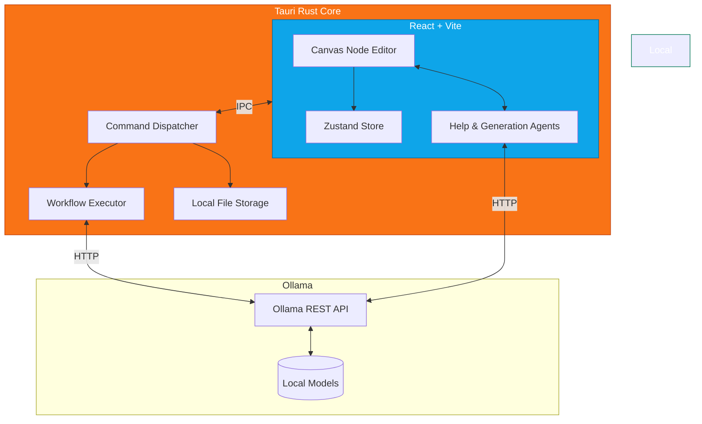

# Hybrid Local AI Hub

**Local-first AI workflow orchestrator Desktop App.** Generate, run, and manage AI automation pipelines entirely on your machine via a visual node-based editor — no cloud, no API keys, no data leaving your system.

Powered by [Ollama](https://ollama.com) for completely offline local LLMs.

<p align="center">
  
</p>

---

## Features

- **Visual Node Editor**: Build and orchestrate AI pipelines by dragging and connecting nodes on a canvas.
- **AI-Powered Chat to Graph**: Tell the built-in AI what you want to achieve, and it will generate the workflow graph for you!
- **Local-First Execution**: Complete privacy. Your data stays on your machine and never goes to the cloud.
- **Built-in Assistant**: Ask the Help Agent to troubleshoot workflows or analyze errors.
- **Library Management**: Save your favorite agents and review their past executions and outputs silently stored in the background.

---

## Architecture

The Hybrid Local AI Hub is built using a secure, local-first architecture:



---

## Quick Start (Development)

### Prerequisites

1. **Ollama** installed on your machine and running (default: `http://127.0.0.1:11434`)
2. **Node.js** (v18+)
3. **Rust** & Cargo (`rustup` recommended)

### Build and Run

```bash
# 1. Clone the repository
git clone <repo-url>
cd hybrid-local-ai-hub

# 2. Install frontend dependencies
npm install

# 3. Start the Tauri application in Development Mode
npm run tauri dev
```

That's it. Real LLM inference, real local files, zero cloud.

---

## Workflow Node Types

Workflows are JSON graphs composed of powerful node types:

| Node | Purpose |
|---|---|
| `OllamaNode` | Calls a local LLM via Ollama |
| `FileWatcherNode` | Triggers on new/changed files in a folder |
| `TextInputNode` | Provides static text or template input |
| `ImageInputNode` | Reads an image from disk |
| `PDFExtractorNode` | Extracts text from PDFs |
| `FileWriterNode` | Writes output to a local file |
| `ConditionalRouterNode` | Routes execution based on content |
| *(More coming soon)* | Local embeddings, Vector DB integrations, etc. |

---

## Recommended Models

For the best experience, ensure you have pulled at least one capable model via Ollama. You can manage models directly within the app!

| Purpose | Model | Why |
|---|---|---|
| **Default chat/generation** | `llama3.2` | Best all-rounder, strong instruction-following |
| **Vision capabilities** | `llava` or `llama3.2-vision` | Ideal for providing screenshots to the Help Agent |
| **Lightest fallback** | `gemma2:2b` | For very RAM-constrained machines |

---

## License

MIT — see [LICENSE](LICENSE).
